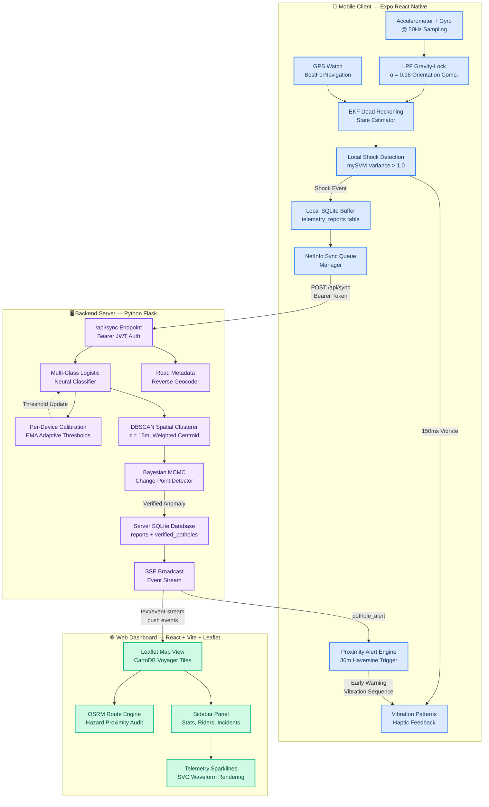

# Khalto (खाल्डो) — Complete System Architecture & Technical Specification

> **Version**: 2.0 — Final Reference Document  
> **Last Updated**: June 2026  
> **System Type**: Real-time, privacy-preserving, crowdsourced road anomaly detection, multi-class classification, municipal asset auditing & hazard-aware routing platform.

---

## Table of Contents

1. [System Overview](#1-system-overview)
2. [Technology Stack](#2-technology-stack)
3. [Project Directory Structure](#3-project-directory-structure)
4. [High-Level Architecture Diagram](#4-high-level-architecture-diagram)
5. [Component Deep Dives](#5-component-deep-dives)
   - 5.1 Mobile Client (Sensor Acquisition Layer)
   - 5.2 Backend Server (Intelligence Layer)
   - 5.3 Web Dashboard (Visualization & Routing Layer)
6. [Data Flow & Component Interactions](#6-data-flow--component-interactions)
7. [Sensor Processing & Classification Mathematics](#7-sensor-processing--classification-mathematics)
8. [Physical Metric Estimation & Priority Scoring](#8-physical-metric-estimation--priority-scoring)
9. [Backend Clustering & Bayesian Verification](#9-backend-clustering--bayesian-verification)
10. [OSRM Routing & Hazard Auditing](#10-osrm-routing--hazard-auditing)
11. [Database Schemas](#11-database-schemas)
12. [API Reference](#12-api-reference)
13. [Authentication & Security Model](#13-authentication--security-model)
14. [Real-Time Communication Architecture](#14-real-time-communication-architecture)
15. [Design & UI/UX Philosophy](#15-design--uiux-philosophy)

---

## 1. System Overview

Khalto is a three-tier distributed system that transforms any smartphone into a road surface quality sensor. It crowdsources accelerometer and gyroscope data from riders and drivers, runs multi-class anomaly classification using a neural-emulating logistic model, spatially clusters reports using DBSCAN, validates defects through Bayesian MCMC change-point detection, and visualizes everything on a real-time web dashboard with OSRM-powered hazard-aware routing.

### Core Capabilities

| Capability | Description |
|:---|:---|
| **Multi-Class Detection** | Classifies shocks into 4 categories: Pothole, Speed Bump, Rough Road, Sudden Braking |
| **Orientation-Invariant Sensing** | LPF gravity-lock compensates for arbitrary phone placement (pocket, mount, dashboard) |
| **Offline-First Mobile** | Local SQLite buffer ensures zero data loss during connectivity gaps |
| **Crowdsourced Verification** | DBSCAN spatial clustering + MCMC Bayesian change-point validation filters noise from real defects |
| **Hazard-Aware Routing** | OSRM shortest-path routing cross-referenced with verified anomalies warns riders of obstacles |
| **Municipal Asset Auditing** | Urgency scoring, contractor metadata, and road creation dates for city infrastructure planning |
| **Per-Device Calibration** | Adaptive thresholds that learn each vehicle's suspension baseline via EMA |
| **Real-Time Push** | Server-Sent Events (SSE) push new detections to all connected clients instantly |
| **Privacy-Preserving** | Device fingerprints are hashed; incident streams show anonymous rider aliases only |

---

## 2. Technology Stack

### 2.1 Backend Server

| Layer | Technology | Version | Purpose |
|:---|:---|:---|:---|
| **Runtime** | Python | 3.14 | Server-side language |
| **Web Framework** | Flask | latest | REST API + SSE streaming server |
| **CORS** | flask-cors | latest | Cross-origin request handling for web dashboard |
| **Database** | SQLite | 3.x (stdlib) | Embedded relational database — zero-config, single-file |
| **DSP/Math** | NumPy | latest | Array math, statistical operations |
| **Signal Processing** | SciPy | latest | Butterworth filters, Welch PSD, spectral band integration |
| **Clustering** | scikit-learn | latest | DBSCAN spatial clustering with precomputed Haversine distance matrix |
| **Auth Tokens** | itsdangerous | latest | `URLSafeTimedSerializer` for JWT-like bearer token generation |
| **Password Hashing** | hashlib (stdlib) | — | SHA-256 salted password hashing |

### 2.2 Mobile Client (Android/iOS)

| Layer | Technology | Version | Purpose |
|:---|:---|:---|:---|
| **Framework** | React Native | 0.81.5 | Cross-platform mobile application framework |
| **Platform** | Expo | SDK 54 | Managed workflow, OTA updates, sensor API access |
| **Sensors** | expo-sensors | ~15.0.8 | 50Hz Accelerometer + Gyroscope subscriptions |
| **GPS** | expo-location | ~19.0.8 | High-accuracy GPS with `BestForNavigation` mode |
| **Local DB** | expo-sqlite | ~16.0.10 | Offline-first telemetry buffer + auth session storage |
| **Networking** | @react-native-community/netinfo | 11.4.1 | Network state monitoring for sync queue management |
| **Map Tiles** | react-native-maps | 1.20.1 | Native `MapView` with CartoDB Voyager overlay tiles |
| **Device ID** | expo-application | ^56.0.3 | Hardware fingerprint (`androidId` / iOS `idForVendor`) |
| **Haptics** | Vibration (RN core) | — | Proximity warning patterns and shock confirmation feedback |

### 2.3 Web Dashboard (Frontend)

| Layer | Technology | Version | Purpose |
|:---|:---|:---|:---|
| **Framework** | React | 19.2.6 | Component-based UI rendering |
| **Build Tool** | Vite | 8.0.12 | Lightning-fast HMR dev server and production bundler |
| **Map Engine** | Leaflet.js | 1.9.4 | Interactive tiled map with circles, polylines, markers |
| **React Bindings** | react-leaflet | 5.0.0 | Declarative Leaflet wrapper for React components |
| **Icons** | lucide-react | 1.17.0 | Premium SVG icon library (Settings, Trophy, RefreshCw) |
| **Charts** | Recharts | 3.8.1 | Data visualization (available for telemetry sparklines) |
| **Map Tiles** | CartoDB Voyager | — | Premium light-mode raster tiles via CDN |
| **Routing Engine** | OSRM (external) | — | Open Source Routing Machine public API for driving directions |

### 2.4 External Services

| Service | URL | Purpose |
|:---|:---|:---|
| **OSRM Public Router** | `router.project-osrm.org` | Shortest-path driving route geometry (GeoJSON polyline) |
| **CartoDB Voyager Tiles** | `a.basemaps.cartocdn.com` | Clean, premium map tile rendering |
| **Google Directions API** | `maps.googleapis.com` (optional) | Traffic congestion checking for bike false-positive filtering |

---

## 3. Project Directory Structure

```
roadsense/
├── Complete_system.md          # This document
├── project.txt                 # Project history log
│
├── backend/                    # Python Flask API Server
│   ├── app.py                  # Main Flask application (routes, SSE, auth, sync pipeline)
│   ├── db.py                   # Database abstraction layer (CRUD, migrations, upserts)
│   ├── detector.py             # Multi-class neural-emulating logistic classifier
│   ├── clustering.py           # DBSCAN spatial clusterer with weighted centroid optimization
│   ├── mcmc.py                 # Bayesian MCMC Metropolis-Hastings change-point detector
│   ├── calibration.py          # Per-device adaptive threshold calibration (EMA learning)
│   ├── schema.sql              # SQL table definitions (reports, verified_potholes, users, calibration)
│   ├── test_pipeline.py        # Backend unit tests
│   ├── requirements.txt        # Python dependencies: flask, flask-cors, numpy, scipy, scikit-learn
│   ├── roadsense.db            # Live SQLite database file (auto-created)
│   └── venv/                   # Python virtual environment
│
├── frontend/                   # React (Vite) Web Dashboard
│   ├── index.html              # HTML entry point
│   ├── vite.config.js          # Vite dev server + API proxy configuration
│   ├── package.json            # Node dependencies (react, leaflet, lucide-react, recharts)
│   ├── src/
│   │   ├── main.jsx            # React DOM root mount
│   │   ├── App.jsx             # Main dashboard component (map, sidebar, routing, SSE)
│   │   ├── App.css             # Full design system (CSS variables, glassmorphism, animations)
│   │   └── assets/             # Static assets
│   ├── dist/                   # Production build output
│   └── node_modules/           # Node packages
│
├── mobile-client/              # Expo React Native Android/iOS Client
│   ├── App.js                  # Monolithic app (auth, sensors, GPS, map, sync, alerts)
│   ├── index.js                # Expo entry point registration
│   ├── app.json                # Expo configuration (permissions, splash, bundleId)
│   ├── src/
│   │   └── data/
│   │       └── db.js           # Local SQLite abstraction (telemetry buffer, auth sessions)
│   ├── assets/                 # Icons, splash screens
│   ├── package.json            # Expo/RN dependencies
│   └── node_modules/           # Node packages
│
└── android-client/             # (Legacy/unused Android native client)
```

---

## 4. High-Level Architecture Diagram



---

## 5. Component Deep Dives

### 5.1 Mobile Client (`mobile-client/App.js`)

The mobile client is the **sensor acquisition and edge-processing layer**. It runs as a single-file Expo React Native application with ~1,360 lines of code.

#### 5.1.1 Sensor Pipeline

```
Raw Accel (x, y, z) @ 50Hz
       ↓
LPF Gravity Lock (α=0.98)
       ↓
Gravity Unit Vector ûg = g/‖g‖
       ↓
Vertical Projection: a_vert = a·ûg
       ↓
Dynamic Acceleration: a_dyn = a_vert - 1.0 G
       ↓
50-Sample Rolling Buffer (1 second window)
       ↓
Variance Calculation: σ² = Σ(xᵢ - μ)²/N
       ↓
Threshold Check: σ² > 1.0/96.2
       ↓  YES
Shock Event → SQLite → Sync Queue
```

**Key Parameters:**
- **Sampling Rate**: 50Hz (20ms update interval)
- **Window Size**: 50 samples (1.0 second)
- **Detection Threshold**: mySVM variance > `1.0 / 96.2 ≈ 0.0104 Gs²`
- **Cooldown**: 2 seconds between consecutive detections
- **GPS Latency Compensation**: 0.8 seconds × speed = coordinate shift backwards along heading

#### 5.1.2 Dead Reckoning State Estimator

Between GPS fixes (which arrive at ~1Hz), the mobile client runs a lightweight dead reckoning model at sensor rate (~50Hz) to estimate position:

1. **Horizontal acceleration isolation**: Subtract gravity vector projection from raw accel to get horizontal dynamic acceleration
2. **Velocity estimation**: Damped Kalman-like update: `v_new = 0.96 × v_prev + 0.04 × v_gps + a_h × dt × 0.02`
3. **Position propagation**: `Δlat = (v × cos(heading) × dt) / 111111`, `Δlng = (v × sin(heading) × dt) / (111111 × cos(lat))`
4. **Throttled broadcast**: Location updates are sent to the backend at ~5Hz (10% of sensor rate) to keep the real-time rider dot smooth on the web dashboard

#### 5.1.3 Proximity Warning System

Every GPS update triggers a proximity scan against all verified potholes:
- **Trigger distance**: 30 meters (Haversine formula)
- **Cooldown per pothole**: 15 seconds (prevents repeated alerts for the same defect)
- **Vibration pattern**: `[0, 80, 80, 80, 80, 300]` — short-short-short-long pulse sequence
- **Visual banner**: Full-width colored alert bar (red for high severity, orange for medium)

#### 5.1.4 SSE Push Listener

The mobile client connects to the backend's SSE stream via `XMLHttpRequest` (React Native's `EventSource` is limited):
- **Heartbeat timeout**: 45 seconds — auto-reconnects if no data received
- **Event types handled**: `sync` (refresh potholes list), `pothole_alert` (remote rider detection alert with double-pulse vibration `[0, 500, 100, 500]`)
- **Reconnection**: Exponential backoff with 3-second base delay

#### 5.1.5 Local SQLite Schema (Mobile)

```sql
-- Offline telemetry buffer
CREATE TABLE telemetry_reports (
    id              INTEGER PRIMARY KEY AUTOINCREMENT,
    lat             REAL NOT NULL,
    lng             REAL NOT NULL,
    speedMs         REAL NOT NULL,
    verticalPower   REAL NOT NULL,
    rawSamplesJson  TEXT NOT NULL,   -- JSON: {svm, x, y, z, gyro, z_variance, speed}
    timestamp       INTEGER NOT NULL,
    isSynced        INTEGER DEFAULT 0
);

-- Persistent key-value config store
CREATE TABLE device_config (
    key   TEXT PRIMARY KEY,
    value TEXT
);
-- Keys: 'fingerprint', 'token', 'username', 'friendly_name', 'device_id'
```

#### 5.1.6 Vehicle Health Degradation

The mobile client tracks simulated suspension health degradation:
- **Standard vehicles**: Degradation rate = `z_variance × 0.025` per shock event
- **Off-road vehicles**: Degradation rate = `z_variance × 0.005` (5× more resilient)
- Health is displayed as a percentage bar and reported with location updates

---

### 5.2 Backend Server (`backend/`)

The backend is the **intelligence and persistence layer** — a Python Flask server with 5 specialized modules.

#### Module Architecture

```
app.py (Flask Routes + SSE + Auth)
  ├── db.py            → SQLite CRUD abstraction layer
  ├── detector.py      → Multi-class logistic classifier
  ├── clustering.py    → DBSCAN spatial aggregator
  ├── mcmc.py          → Bayesian change-point validator
  └── calibration.py   → Per-device adaptive thresholds
```

#### 5.2.1 `app.py` — Flask Application Server (629 lines)

**Responsibilities:**
- HTTP REST API routing (11 endpoints)
- SSE event broadcasting via `queue.Queue` fan-out
- Authentication (register/login with timed bearer tokens)
- The main sync pipeline orchestrator (sensor data in → classified, clustered, verified anomaly out)
- In-memory `active_locations` dict for real-time rider tracking
- Google Traffic API integration for false-positive filtering on bikes
- Simulated road metadata reverse geocoder (Kathmandu road names, contractors, dates)
- Friendly name generator from device fingerprint hashes (e.g., "Swift Rider (A3F2)")

**In-Memory State:**

```python
sse_listeners = []          # List[queue.Queue] — one per connected SSE client
active_locations = {}       # Dict[str, dict] — rider_key → {lat, lng, speed, health, ...}
detectors = {}              # Dict[str, PotholeDetector] — cached per device_id
```

#### 5.2.2 `detector.py` — Multi-Class Classifier (162 lines)

**Pipeline:**
1. **Highpass filter** (4th-order Butterworth, cutoff 0.5Hz) → removes DC gravity drift
2. **Spectral band power** (Welch PSD, 5-20Hz band) → isolates pothole frequency energy
3. **Feature extraction**: RMS energy, Peak amplitude, Zero-Crossing Rate (ZCR)
4. **Logit computation**: Weighted linear combinations of features → Sigmoid activation
5. **Argmax classification**: Assigns class with highest probability
6. **Physical estimation**: Depth (mm), surface area (cm²), urgency score (0-100)
7. **Severity mapping**: Urgency > 65 → High, > 35 → Medium, else → Low

**Output**: `DetectionResult` dataclass with 10 fields.

#### 5.2.3 `clustering.py` — DBSCAN Spatial Clusterer (135 lines)

**Algorithm:**
1. Build coordinate array from recent 500 reports + new report
2. Compute full pairwise Haversine distance matrix (vectorized NumPy)
3. Run scikit-learn DBSCAN with `metric='precomputed'`, `eps=15m`, `min_samples=1` (demo mode)
4. Extract cluster containing the new report
5. Compute **weighted centroid** where weights = `confidence × C_vehicle × C_severity`
   - Cars weighted 2.0× (stable chassis = higher location integrity)
   - High severity weighted 1.5×, Low weighted 0.7×
6. Majority vote for cluster severity

#### 5.2.4 `mcmc.py` — Bayesian Change-Point Detector (124 lines)

**Algorithm**: Metropolis-Hastings sampler over confidence sequences
- **Prior**: Beta(2,2) on change-point index τ (prevents edge effects)
- **Likelihood**: Two-segment Normal model with separate means and variances
- **Samples**: 1,500 iterations, 300 burn-in
- **Proposal**: Random walk with steps ∈ {-2, -1, +1, +2}
- **Acceptance**: Log-space Metropolis ratio
- **Verification criteria**: Posterior probability > 0.35 AND post-change mean > pre-change mean + 0.1
- **Demo bypass**: Single report count ≥ 1 triggers immediate verification

#### 5.2.5 `calibration.py` — Adaptive Threshold Manager (112 lines)

**Two-phase calibration:**

1. **Initial Calibration** (first 50 samples):
   - Collects RMS values of sensor windows
   - Computes baseline `μ_baseline` and `σ_baseline`
   - Sets threshold = `μ + 2.5σ` (with minimum σ floor of 0.2)
   - Lateral threshold scales proportionally at 30%

2. **Online Adaptation** (every 10 samples after calibration):
   - Exponential Moving Average (α = 0.05) updates baseline mean
   - Prevents single-pothole feedback loops
   - Slowly adapts to changing road conditions, tire pressure, or vehicle load

---

### 5.3 Web Dashboard (`frontend/src/App.jsx`)

The web dashboard is the **visualization and analysis layer** — a React single-page application.

#### Component Hierarchy

```
App (root)
├── LeafletMap
│   ├── Verified Pothole Circles (colored by anomaly_type)
│   ├── Unverified Incident Circles (dashed border)
│   ├── Active Rider Markers (pulsing blue dots)
│   ├── Start/End Route CircleMarkers (green/red)
│   └── Route Polyline (blue, weight 6)
│
├── Route Hazard Auditor Panel
│   ├── Start/Destination coordinate display
│   ├── Route info (distance, duration)
│   └── Obstacle breakdown per anomaly type
│
├── Stats Cards (3-column grid)
│   ├── Verified Potholes count
│   ├── High Severity count
│   └── Total Reports count
│
├── Online Riders & Vehicle Health Panel
│   ├── Rider cards with health bar visualization
│   └── Click-to-center-map interaction
│
├── Crowdsourced Leaderboard
│   └── Top 10 pothole detectors ranked by report count
│
├── Anonymous Incident Stream
│   ├── Incident log entries with metadata
│   └── TelemetrySparkline SVG waveforms
│
└── TelemetrySparkline (SVG)
    └── Renders raw SVM waveform as polyline chart
```

#### Map Interaction Model

| User Action | Behavior |
|:---|:---|
| **1st click on map** | Sets Start point (green marker) |
| **2nd click on map** | Sets Destination (red marker) → triggers OSRM route fetch |
| **3rd click on map** | Resets Start to new location, clears Destination |
| **Click Clear button** | Removes both markers and route |
| **Click rider card** | Pans map to rider's live location |
| **SSE `sync` event** | Refetches all data from API |
| **SSE `location_update`** | Updates rider position in-place without full refetch |

---

## 6. Data Flow & Component Interactions

### 6.1 Detection → Verification Flow (End-to-End)

```
Step 1: SENSOR ACQUISITION (Mobile)
┌─────────────────────────────────────────────┐
│ Accelerometer @ 50Hz → LPF Gravity Lock     │
│ → Vertical Projection → Dynamic Accel       │
│ → 50-sample Buffer → Variance Check         │
│ → σ² > threshold → SHOCK EVENT TRIGGERED    │
└─────────────────────┬───────────────────────┘
                      ↓
Step 2: LOCAL PERSISTENCE (Mobile SQLite)
┌─────────────────────────────────────────────┐
│ Telemetry JSON = {svm, x, y, z, gyro,       │
│   z_variance, speed}                         │
│ + GPS Latency-Corrected Coordinates          │
│ → INSERT INTO telemetry_reports              │
└─────────────────────┬───────────────────────┘
                      ↓
Step 3: NETWORK SYNC (Mobile → Backend)
┌─────────────────────────────────────────────┐
│ NetInfo checks connectivity                  │
│ → SELECT * WHERE isSynced = 0                │
│ → POST /api/sync (Bearer Token, JSON array)  │
│ → Mark synced, prune local DB                │
└─────────────────────┬───────────────────────┘
                      ↓
Step 4: CLASSIFICATION (Backend detector.py)
┌─────────────────────────────────────────────┐
│ Highpass Filter → Spectral Analysis          │
│ → Feature Extraction (RMS, Peak, ZCR)        │
│ → Logit Computation (4 classes)              │
│ → Sigmoid Activation → Argmax                │
│ → Physical Estimation (depth, area, urgency) │
│ → Output: DetectionResult                    │
└─────────────────────┬───────────────────────┘
                      ↓
Step 5: SPATIAL CLUSTERING (Backend clustering.py)
┌─────────────────────────────────────────────┐
│ Fetch recent 500 reports                     │
│ → Build Haversine distance matrix            │
│ → DBSCAN (ε=15m)                             │
│ → Weighted centroid optimization             │
│ → Majority severity vote                     │
└─────────────────────┬───────────────────────┘
                      ↓
Step 6: BAYESIAN VERIFICATION (Backend mcmc.py)
┌─────────────────────────────────────────────┐
│ Extract confidence sequence from cluster     │
│ → Metropolis-Hastings (1500 samples)         │
│ → MAP estimate of change-point τ             │
│ → Posterior probability > 0.35?              │
│ → Mean shift upward > 0.1?                   │
│ YES → VERIFIED ANOMALY                       │
└─────────────────────┬───────────────────────┘
                      ↓
Step 7: PERSISTENCE & BROADCAST (Backend)
┌─────────────────────────────────────────────┐
│ UPSERT verified_potholes (rolling averages)  │
│ → SSE broadcast "pothole_alert" to all       │
│   connected web + mobile clients             │
│ → SSE broadcast "sync" for data refresh      │
└─────────────────────┬───────────────────────┘
                      ↓
Step 8: VISUALIZATION (Web Dashboard)
┌─────────────────────────────────────────────┐
│ SSE listener receives event                  │
│ → Refetches /api/potholes, /api/incidents    │
│ → Leaflet redraws circles, markers           │
│ → Route hazard auditor recalculates          │
└─────────────────────────────────────────────┘
```

### 6.2 Real-Time Location Tracking Flow

```
Mobile (GPS Watch @ 1Hz)
    ↓
POST /api/location {lat, lng, speed, vehicle_class}
    ↓
Backend updates active_locations[rider_key]
    ↓
SSE broadcast {type: "location_update", rider: {...}}
    ↓
Web Dashboard updates rider marker position
    ↓
Rider card shows live speed + vehicle health bar
```

### 6.3 Proximity Warning Flow (Mobile)

```
GPS Fix arrives (1Hz)
    ↓
For each verified_pothole:
    Haversine(user_location, pothole) < 30m?
    ↓  YES
    Check cooldown (15s per pothole)
    ↓  Not recently warned
    Log: "🚨 WARNING: Approaching HIGH severity POTHOLE!"
    Vibrate: [0, 80, 80, 80, 80, 300]  (short-short-short-long)
    Show red/orange warning banner overlay
```

### 6.4 Authentication Flow

```
Mobile Auth Screen
    ↓
POST /api/auth/register  OR  POST /api/auth/login
    { username, password, device_id }
    ↓
Backend: hash_password(password + salt)
    → Create/validate user in users table
    → Generate timed token via URLSafeTimedSerializer
    ↓
Response: { token, username, friendly_name }
    ↓
Mobile: Save to SQLite device_config table
    → Connect SSE stream with token query param
    → Begin GPS watch + sensor recording
```

---

## 7. Sensor Processing & Classification Mathematics

### 7.1 Orientation-Compensated Gravity Vector Lock (LPF)

Smartphones placed in mounts, pockets, or console compartments sit at arbitrary angles. To isolate true vertical shocks, we apply a low-pass filter (LPF) to raw acceleration components $(a_x, a_y, a_z)$ to lock onto the downward gravity vector $g$:

$$g_x^{(t)} = \alpha \cdot g_x^{(t-1)} + (1 - \alpha) \cdot a_x^{(t)}$$
$$g_y^{(t)} = \alpha \cdot g_y^{(t-1)} + (1 - \alpha) \cdot a_y^{(t)}$$
$$g_z^{(t)} = \alpha \cdot g_z^{(t-1)} + (1 - \alpha) \cdot a_z^{(t)}$$

*(Tuned coefficient $\alpha = 0.98$ at $50\text{Hz}$ sampling frequency).*

We normalize the gravity vector to yield a unit vector $u_g$:

$$u_g = \frac{g}{\|g\|} = \left( \frac{g_x}{\sqrt{g_x^2 + g_y^2 + g_z^2}}, \frac{g_y}{\sqrt{g_x^2 + g_y^2 + g_z^2}}, \frac{g_z}{\sqrt{g_x^2 + g_y^2 + g_z^2}} \right)$$

We project the raw acceleration vector $a$ onto the locked gravity unit vector $u_g$ to isolate the vertical acceleration component $a_{\text{vertical}}$:

$$a_{\text{vertical}} = a_x \cdot u_{g,x} + a_y \cdot u_{g,y} + a_z \cdot u_{g,z}$$

Subtracting Earth's constant $1.0\text{ G}$ yields the dynamic vertical acceleration $a_{\text{dynamic}}$:

$$a_{\text{dynamic}} = a_{\text{vertical}} - 1.0\text{ G}$$

### 7.2 Signal Feature Extraction

The classifier extracts three primary features from a rolling $1.0\text{-second}$ (50-sample) window of cleaned vertical dynamic samples:

1. **Root Mean Square (RMS) Energy**:
   $$\text{RMS} = \sqrt{\frac{1}{N} \sum_{i=1}^N a_{\text{dynamic},i}^2}$$

2. **Peak Amplitude**:
   $$\text{Peak} = \max_i |a_{\text{dynamic},i}|$$

3. **Zero-Crossing Rate (ZCR)**:
   $$\text{ZCR} = \frac{1}{N-1} \sum_{i=1}^{N-1} \mathbb{I}(\text{sign}(a_{\text{dynamic},i}) \neq \text{sign}(a_{\text{dynamic},i+1}))$$
   *(where $\mathbb{I}$ is the indicator function).*

### 7.3 Multi-Class Neural-Emulating Classifier

We compute logits for the four anomaly categories using linear combinations of features, passing them through Sigmoid activations:

$$\text{logit}_{\text{pothole}} = -2.2 + 3.8 \cdot \text{RMS} + 0.8 \cdot \text{Peak} - 2.5 \cdot \text{ZCR}$$
$$\text{logit}_{\text{speed\_bump}} = -1.5 - 0.8 \cdot \text{RMS} + 1.2 \cdot \left(\frac{\text{Duration}_{\text{ms}}}{100}\right) - 3.5 \cdot \text{ZCR}$$
$$\text{logit}_{\text{rough\_road}} = -2.5 + 2.2 \cdot \text{RMS} - 1.0 \cdot \text{Peak} + 1.5 \cdot \text{ZCR}$$
$$\text{logit}_{\text{sudden\_brake}} = -2.0 - 2.5 \cdot P_{\text{vertical}} + 4.0 \cdot P_{\text{lateral}}$$

**Physical Constraints:**
* If $\text{Duration}_{\text{ms}} \ge 180\text{ms}$: $\text{logit}_{\text{pothole}} -= 15.0$ (shock duration exceeds physical bounds for a pothole)
* If $\text{ZCR} \le 0.08$: $\text{logit}_{\text{pothole}} -= 10.0$ (insufficient frequency content for a pothole signature)

Sigmoid probabilities:

$$p_{\text{class}} = \frac{1}{1 + e^{-\text{logit}_{\text{class}}}}$$

The assigned class is chosen via argmax:

$$\text{anomaly\_type} = \arg\max_{\text{class}} \{p_{\text{pothole}}, p_{\text{speed\_bump}}, p_{\text{rough\_road}}, p_{\text{sudden\_brake}}\}$$

---

## 8. Physical Metric Estimation & Priority Scoring

### 8.1 Dimensions Estimation

| Anomaly Type | Metric | Formula |
|:---|:---|:---|
| **Pothole** | Depth $D$ (mm) | $D = P_{\text{vertical}} \cdot 14.5$ |
| **Pothole** | Surface Area $A$ (cm²) | $A = \text{Duration}_{\text{ms}} \cdot 0.75$ |
| **Speed Bump** | Height $H$ (mm) | $H = \text{RMS} \cdot 38.0$ |
| **Speed Bump** | Surface Area (cm²) | $A = \text{Duration}_{\text{ms}} \cdot 1.4$ |
| **Rough Road** | Surface Deviation $R$ (mm) | $R = \text{RMS} \cdot 4.5$ |
| **Rough Road** | Surface Area (cm²) | $A = \text{Duration}_{\text{ms}} \cdot 4.8$ |
| **Sudden Brake** | Area proxy (cm²) | $A = P_{\text{lateral}} \cdot 12.0$ |

### 8.2 Municipal Urgency Priority Score

To help city planners prioritize repairs, Khalto generates an **Urgency Score** ($S_{\text{urgency}} \in [0, 100]$):

$$S_{\text{urgency, pothole}} = \min\left(100.0, \; \frac{D}{60} \cdot 45 + \frac{A}{200} \cdot 35 + \text{Confidence} \cdot 20\right)$$
$$S_{\text{urgency, speed\_bump}} = \min\left(50.0, \; \frac{H}{100} \cdot 20 + \text{Confidence} \cdot 30\right)$$
$$S_{\text{urgency, rough\_road}} = \min\left(70.0, \; \frac{R}{15} \cdot 40 + \text{Confidence} \cdot 30\right)$$
$$S_{\text{urgency, sudden\_brake}} = \min\left(35.0, \; \frac{P_{\text{lateral}}}{2} \cdot 25 + \text{Confidence} \cdot 10\right)$$

**Severity Mapping**: $S > 65 \rightarrow$ High, $S > 35 \rightarrow$ Medium, else $\rightarrow$ Low

---

## 9. Backend Clustering & Bayesian Verification

### 9.1 DBSCAN Weighted Centroid Optimizer

Incoming reports are clustered using DBSCAN (ε = 15 meters, precomputed Haversine distance matrix). Instead of a simple geographic average, the cluster's verified coordinate is computed using a weighted spatial centroid:

$$\text{Centroid}_{\text{lat}} = \frac{\sum_{i=1}^n \text{lat}_i \cdot w_i}{\sum_{i=1}^n w_i}, \quad \text{Centroid}_{\text{lng}} = \frac{\sum_{i=1}^n \text{lng}_i \cdot w_i}{\sum_{i=1}^n w_i}$$

Where the weight $w_i$ combines report confidence, severity, and vehicle class:

$$w_i = \text{Confidence}_i \cdot C_{\text{vehicle}} \cdot C_{\text{severity}}$$

- **$C_{\text{vehicle}}$**: Cars/SUVs weighted $2.0\times$ (stable chassis suspensions produce higher location integrity)
- **$C_{\text{severity}}$**: High = $1.5$, Medium = $1.0$, Low = $0.7$

### 9.2 Bayesian MCMC Change-Point Verification

To verify if a clustered location represents a permanent physical road defect rather than transient driver behavior, we model the sequence of report confidence values $\{x_1, x_2, \dots, x_t\}$ using a Bayesian change-point model.

We assume the confidence values are drawn from a normal distribution whose mean shifts from a baseline $\mu_1$ (random noise) to a post-defect mean $\mu_2$ (persistent defect) at an unknown index $\tau$:

$$x_i \sim \mathcal{N}(\mu_1, \sigma^2) \quad \text{for } i < \tau$$
$$x_i \sim \mathcal{N}(\mu_2, \sigma^2) \quad \text{for } i \ge \tau$$

We place a **Beta(2,2) prior** on the normalized change-point location $\tau/N$ (prevents edge effects), and conjugate normal priors on the means.

**Metropolis-Hastings Sampling:**
- **Iterations**: 1,500 total (300 burn-in, 1,200 posterior)
- **Proposal**: Random walk ∈ {-2, -1, +1, +2}
- **Acceptance**: $\log \alpha = (\log p_{\text{proposed}} + \log L_{\text{proposed}}) - (\log p_{\text{current}} + \log L_{\text{current}})$

The posterior probability of a change-point existence:

$$P(\text{Defect Present} \mid \{x\}) = \frac{\max(\text{counts})}{|\text{posterior samples}|}$$

**Verification criteria:**
- Posterior probability $> 0.35$ (sampler converged on a consistent τ)
- Post-change mean $> $ pre-change mean $+ 0.1$ (genuine upward confidence shift)
- **OR** cluster report count ≥ 1 (demo mode bypass)

---

## 10. OSRM Routing & Hazard Auditing

The Web Dashboard's Route Hazard Auditor allows users to plan routes and receive warnings about road anomalies along their path.

### 10.1 Route Fetching

1. User clicks two points on the map (Start → Destination)
2. Frontend queries the OSRM public API:
   ```
   GET https://router.project-osrm.org/route/v1/driving/{startLng},{startLat};{endLng},{endLat}?overview=full&geometries=geojson
   ```
3. Response contains GeoJSON polyline coordinates + total distance/duration

### 10.2 Hazard Proximity Search

For each verified anomaly $Q$ at coordinate $(q_{\text{lat}}, q_{\text{lng}})$ and each route segment $S_j = [P_j, P_{j+1}]$:

1. Convert geographic coordinates to a local Cartesian frame (meters)
2. Compute point-to-segment distance using vector projection:
   ```
   t = clamp((P⃗Q · A⃗B) / (A⃗B · A⃗B), 0, 1)
   nearest = A + t × A⃗B
   distance = ‖P⃗Q - nearest‖
   ```
3. If $\min_j \text{dist}(Q, S_j) < 25\text{ meters}$, the anomaly is flagged as a route hazard

### 10.3 Route Info Display

The auditor panel shows:
- **Total distance** (km) and **estimated time** (minutes)
- **Hazard count** with per-type breakdown: 🕳️ Potholes, 🐫 Bumps, 🚧 Rough, ⚠️ Braking
- **Color coding**: Red background if hazards exist, green if route is clear

---

## 11. Database Schemas

### 11.1 `reports` Table

Stores raw shock candidates synchronized from mobile devices.

| Column | Type | Description |
|:---|:---|:---|
| `id` | INTEGER | Primary Key (Auto-Increment) |
| `lat` | REAL | Latitude coordinate |
| `lng` | REAL | Longitude coordinate |
| `device_id` | TEXT | Device fingerprint UUID |
| `confidence` | REAL | Classifier confidence score (0.0 - 1.0) |
| `severity` | TEXT | Low, Medium, High mapping |
| `vertical_power` | REAL | Spectral band power in 5-20Hz |
| `z_variance` | REAL | Vertical axis variance |
| `speed` | REAL | Vehicle speed in m/s |
| `telemetry_json` | TEXT | Full 3-axis accelerometer & gyro sample array |
| `username` | TEXT | Syncing rider username |
| `friendly_name` | TEXT | Friendly name mapping |
| `timestamp` | INTEGER | Device logging epoch millisecond |
| `anomaly_type` | TEXT | Class: pothole, speed_bump, rough_road, sudden_brake |
| `depth_mm` | REAL | Estimated depth of anomaly |
| `area_cm2` | REAL | Estimated surface area |
| `urgency_score` | REAL | Urgency score index (0 - 100) |
| `road_name` | TEXT | Simulated reverse geocoded street name |
| `contractor` | TEXT | Municipal road contractor responsible |
| `road_creation_date` | TEXT | Historical resurfacing date |
| `created_at` | DATETIME | Server insertion timestamp |

### 11.2 `verified_potholes` Table

Stores spatially aggregated, MCMC-validated road defects.

| Column | Type | Description |
|:---|:---|:---|
| `id` | INTEGER | Primary Key (Auto-Increment) |
| `lat` | REAL | Weighted centroid latitude coordinate |
| `lng` | REAL | Weighted centroid longitude coordinate |
| `report_count` | INTEGER | Count of aggregated reports in cluster |
| `severity` | TEXT | Aggregated severity voting value |
| `mcmc_confidence` | REAL | MCMC change-point posterior probability |
| `anomaly_type` | TEXT | Class: pothole, speed_bump, rough_road, sudden_brake |
| `depth_mm` | REAL | Rolling average depth (centroid average) |
| `area_cm2` | REAL | Rolling average area (centroid average) |
| `urgency_score` | REAL | Rolling average priority score |
| `road_name` | TEXT | Street name metadata |
| `contractor` | TEXT | Municipal contractor metadata |
| `road_creation_date` | TEXT | Resurfacing date metadata |
| `first_reported` | DATETIME | Timestamp of first cluster report |
| `last_updated` | DATETIME | Timestamp of last cluster update |

### 11.3 `users` Table

| Column | Type | Description |
|:---|:---|:---|
| `username` | TEXT | Primary Key |
| `password_hash` | TEXT | SHA-256 salted hash |
| `device_id` | TEXT | Associated hardware fingerprint |
| `created_at` | DATETIME | Account creation timestamp |

### 11.4 `calibration` Table

| Column | Type | Description |
|:---|:---|:---|
| `device_id` | TEXT | Primary Key |
| `threshold_vertical` | REAL | Calibrated vertical detection threshold |
| `threshold_lateral` | REAL | Calibrated lateral detection threshold |
| `baseline_mean` | REAL | Road surface roughness baseline mean |
| `baseline_std` | REAL | Road surface roughness baseline std deviation |
| `sample_count` | INTEGER | Total calibration samples collected |
| `updated_at` | DATETIME | Last calibration update |

---

## 12. API Reference

### 12.1 Authentication Endpoints

| Method | Path | Auth | Description |
|:---|:---|:---|:---|
| POST | `/api/auth/register` | None | Create new user account |
| POST | `/api/auth/login` | None | Authenticate and get bearer token |
| GET | `/api/auth/me` | Bearer | Get current user info |

### 12.2 Data Endpoints

| Method | Path | Auth | Description |
|:---|:---|:---|:---|
| POST | `/api/sync` | Bearer | Upload telemetry batch for classification |
| GET | `/api/potholes` | None | Get all verified anomalies |
| GET | `/api/stats` | None | Get aggregate statistics |
| GET | `/api/incidents` | None | Get recent anonymized incidents |
| POST | `/api/location` | Bearer/Guest | Update rider live location |
| GET | `/api/locations` | None | Get active riders (< 60s stale) |
| GET | `/api/leaderboard` | None | Get top 10 reporters |
| POST | `/api/reset` | Bearer | Reset database tables |

### 12.3 Streaming Endpoint

| Method | Path | Auth | Description |
|:---|:---|:---|:---|
| GET | `/api/stream` | Token query param | SSE event stream |

**SSE Event Types:**

| Event Type | Payload | Trigger |
|:---|:---|:---|
| `connected` | `{}` | Initial connection established |
| `heartbeat` | `{}` | Every 20 seconds (keepalive) |
| `sync` | `{data: "updated"}` | New telemetry batch processed |
| `pothole_alert` | `{pothole: {...}}` | New verified anomaly confirmed |
| `location_update` | `{rider: {...}}` | Rider position changed |

---

## 13. Authentication & Security Model

### 13.1 Token System

- **Generator**: `itsdangerous.URLSafeTimedSerializer` with secret salt `"roadsense_secret_salt_12345"`
- **Token lifetime**: 30 days (`max_age=86400 * 30`)
- **Transport**: `Authorization: Bearer <token>` header, or `?token=<token>` query param (for SSE)
- **Fallback**: Unauthenticated requests gracefully degrade to guest credentials (`username="guest"`)

### 13.2 Password Storage

- **Algorithm**: SHA-256 with static salt `"roadsense_pwd_salt_54321"`
- **Formula**: `hash = sha256(password + salt)`

### 13.3 Privacy Features

- **Device fingerprints** are hashed with MD5 for friendly name generation — raw IDs never leave the device
- **Incident stream** shows anonymous rider aliases (e.g., "Swift Rider (A3F2)") — not real usernames
- **Telemetry JSON** stores raw sensor data but is never exposed to other users directly

---

## 14. Real-Time Communication Architecture

### 14.1 Server-Sent Events (SSE) Architecture

```
                    ┌─────────────────────┐
                    │    Flask Server      │
                    │                     │
    Mobile ──SSE──→ │  sse_listeners[]    │ ←──SSE── Web Dashboard
    Client          │  [Q1, Q2, Q3, ...]  │          (EventSource)
    (XHR)           │                     │
                    │  On sync/alert:     │
                    │   for q in listeners:│
                    │     q.put_nowait(msg)│
                    └─────────────────────┘
```

- Each connected client gets a dedicated `queue.Queue`
- The SSE endpoint blocks on `q.get(timeout=20)` — sends heartbeat on timeout
- On sync or alert events, the server iterates all listener queues and pushes the event
- Failed pushes are silently ignored (client may have disconnected)
- `GeneratorExit` cleanup removes the queue from the listeners list

### 14.2 Data Refresh Strategy

The web dashboard uses a **dual-channel** refresh strategy:

1. **SSE Push** (primary): Instant updates on sync/alert events
2. **Polling** (fallback): `setInterval(fetchPublicData, 1000)` — 1-second polling as safety net

The mobile client uses:
1. **SSE Push** via XHR (primary): Real-time pothole alerts from other riders
2. **Polling** (fallback): `setInterval(downloadPotholesList, 2000)` — 2-second polling

---

## 15. Design & UI/UX Philosophy

### 15.1 Visual Design System

**Color Palette (Light Mode — Slate Base):**

| Token | Value | Usage |
|:---|:---|:---|
| `--bg-color` | `#f8fafc` | Page background |
| `--panel-bg` | `rgba(255,255,255,0.85)` | Sidebar glassmorphic background |
| `--border-color` | `rgba(15,23,42,0.08)` | Subtle dividers |
| `--text-primary` | `#0f172a` | Headings, labels |
| `--text-secondary` | `#475569` | Descriptions, metadata |
| `--accent-color` | `#2563eb` | Interactive elements, links |
| `--success-color` | `#10b981` | Healthy states, clear routes |
| `--warning-color` | `#d97706` | Medium severity |
| `--danger-color` | `#dc2626` | High severity, alerts |

**Anomaly Color Coding:**

| Type | Color | Emoji |
|:---|:---|:---|
| Pothole | `#ef4444` (Red) | 🕳️ |
| Speed Bump | `#d97706` (Amber) | 🐫 |
| Rough Road | `#854d0e` (Brown) | 🚧 |
| Sudden Braking | `#7c3aed` (Purple) | ⚠️ |

### 15.2 Map Tile Provider

**CartoDB Voyager** (`rastertiles/voyager`) — a clean, modern, light-colored basemap that doesn't compete with data overlays. Used consistently across both web (Leaflet) and mobile (react-native-maps UrlTile).

### 15.3 Interactive Elements

- **Glassmorphic panels**: `backdrop-filter: blur(16px)` with translucent backgrounds
- **Pulsing rider dots**: CSS keyframe animation `rider-pulse` with expanding/fading ring
- **Stat card hover**: `translateY(-2px)` lift effect
- **Health bars**: Dynamic color gradient (green → amber → red) based on percentage
- **Telemetry sparklines**: Inline SVG polyline charts showing raw SVM waveform per incident
- **Route hazard highlighting**: Encountered potholes rendered with `fillOpacity: 0.75` and `weight: 4` (thicker border)

### 15.4 Mobile UX

- **Floating control panel**: Bottom-positioned glassmorphic card with rounded corners
- **Auth screen**: Full-screen map backdrop with dimmed overlay and centered auth card
- **Warning banners**: Top-positioned, full-width, auto-dismissed after 5 seconds
- **Vehicle class selector**: Horizontal pill buttons with active state highlighting
- **Logs console**: Monospace terminal-style scrolling log view

========================================================================
